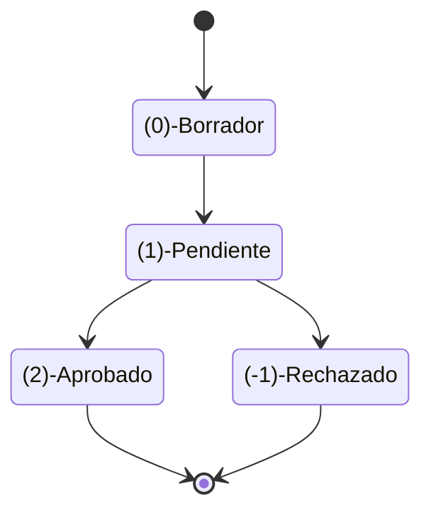
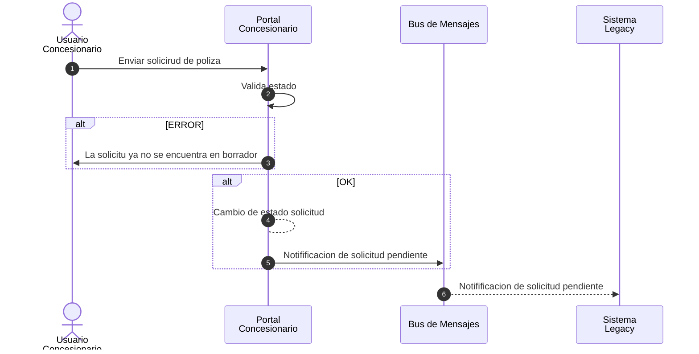
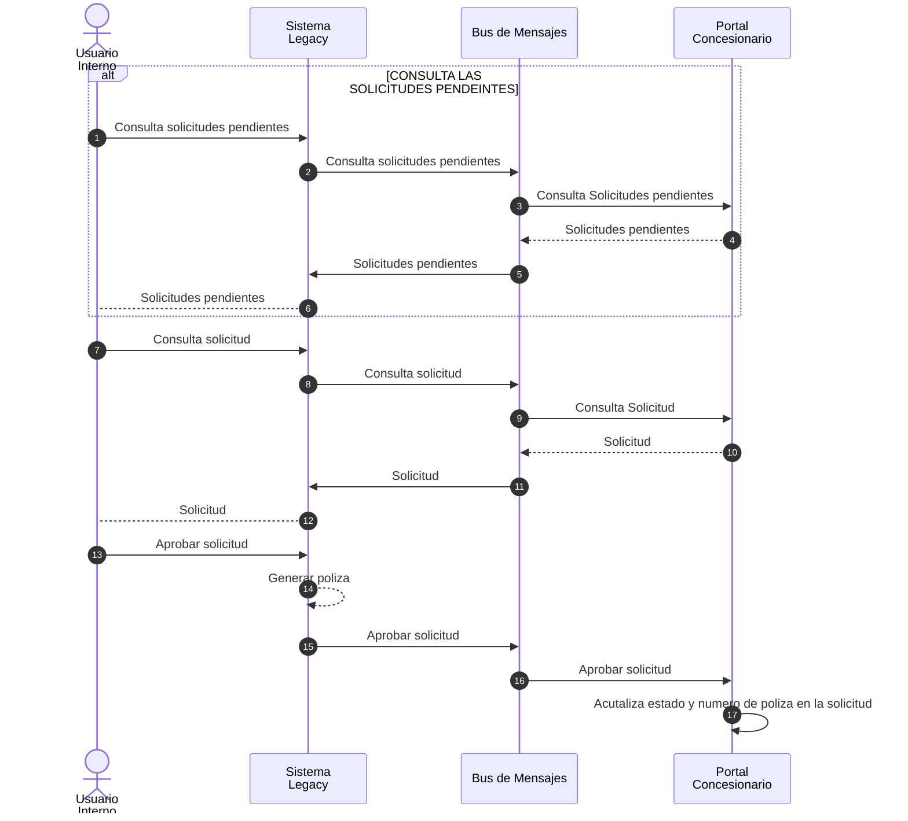
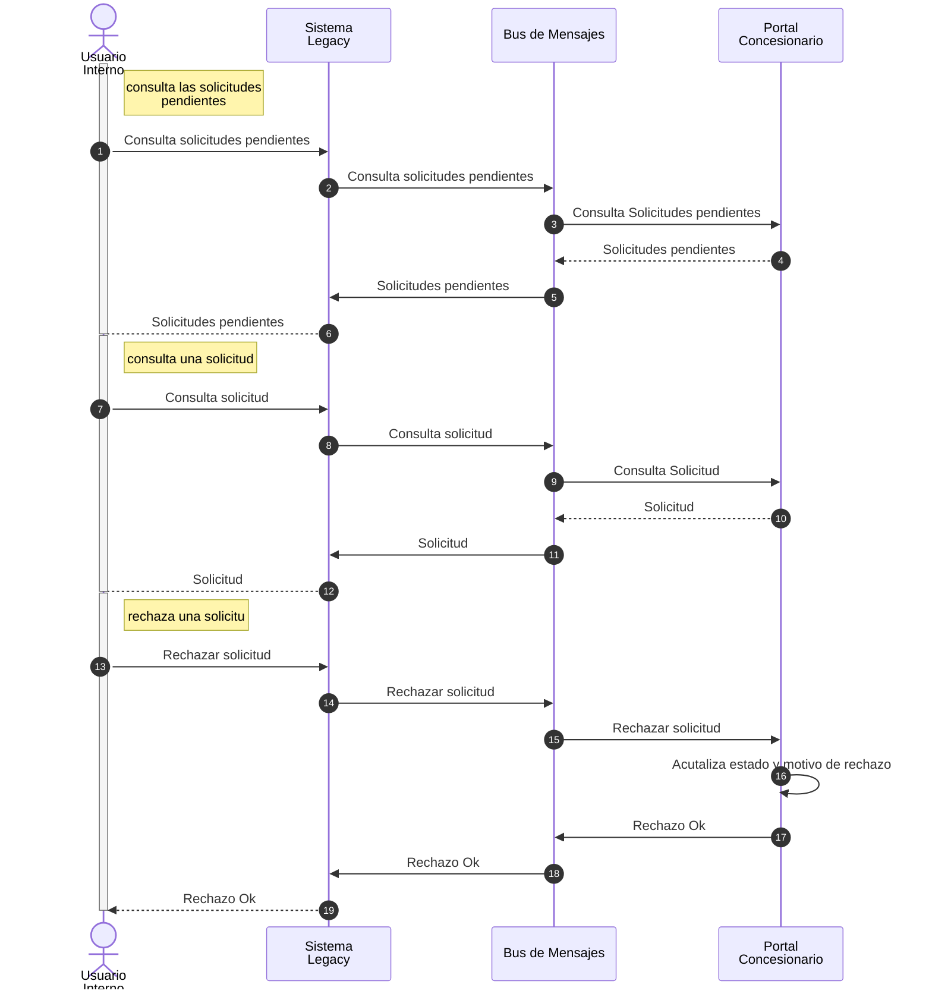

# Alta de Pólizas

Una empresa de seguros tiene un acuerdo con varias concesionarias agrícolas para asegurar la maquinaria adquirida en las mismas.

Actualmente el personal de las concesionarias envía la documentación vía correo electrónico, firmada digitalmente. Posteriormente, el personal de la empresa de seguros recibe esta información, la ingresa manualmente en el sistema, realiza validaciones, y luego informa a la concesionaria, también por correo electrónico, el número de póliza o si se requiere completar información adicional o enviar más documentación de respaldo.

La empresa desea reemplazar este proceso manual por un Portal de Concesionarios que permita la autogestión del alta de pólizas y la automatización del control. Este portal será utilizado por los concesionarios para cargar la información y seguimiento de las pólizas de manera más eficiente.

## Requisitos del Sistema

El equipo de seguridad informática y riesgos ha establecido las siguientes condiciones para el nuevo sistema:

1. Implementar HTTPS: El portal debe utilizar protocolos de seguridad (HTTPS) para garantizar la privacidad de la información.
2. Autenticación y autorización: Los usuarios deben autenticarse y tener permisos adecuados para realizar operaciones según su rol.
3. Acceso restringido: El nuevo portal no debe tener acceso directo a las tablas del sistema interno de pólizas. Se busca minimizar los riesgos de seguridad y accesos no autorizados.
4. Carga en “borrador”: Los usuarios deben tener la posibilidad de guardar las solicitudes de póliza como "borrador" y editarlas en varias sesiones, antes de enviarlas para su aprobación definitiva.
5. Eliminación de doble carga: El personal de la empresa de seguros debe poder revisar, aprobar o rechazar las solicitudes de pólizas, sin necesidad de volver a cargar los datos en el sistema legacy.  
   a. Aprobación de pólizas: Cuando se aprueba una solicitud, se genera automáticamente una póliza en el sistema legacy, y la solicitud cambia su estado a “Aprobada”.  
   b. Rechazo de pólizas: Si se rechaza una solicitud, se cambia el estado a “Rechazada” y se agregan observaciones explicativas.

## Aclaraciones

- El sistema actual es un desarrollo in-house y monolítico, implementado con una interfaz web basada en el patrón MVC. Es posible realizar adecuaciones al sistema existente.
- Se requiere una arquitectura a nivel de contenedor, no de componentes.

## Tareas

Teniendo en cuenta los requisitos mencionados:

1. Defina la estructura de la arquitectura que soportará el portal de concesionarios, especificando la interacción/integración entre los diferentes sistemas
2. Tome decisiones de arquitectura en cuanto a seguridad, desacoplamiento del sistema legacy y manejo de estados de solicitudes.
3. Realice un diagrama de contenedores según el modelo C4, detallando las interacciones entre los componentes principales (portal, sistema legacy, bases de datos).
4. Defina casos de uso y secuencias que reflejen las interacciones de los usuarios con el sistema (que tengan que ver con la solicitud de póliza, su carga, envío, aprobación/rechazo). Defina el diagrama de estados de una solicitud de póliza
5. Especifique los contratos relevantes para la comunicación entre el portal y el backend. (excluyendo el detalle de la póliza que todavía no esta definido )

Si se asume algún supuesto, este debe ser aclarado.

# Solucion

Se decide crear el Portal de Concesionarios con una **arquitectura por capas** con una interface de usuario MVC. Con una administración de usuarios independiente al sistema anterior (AKA Sistema Legacy).

Se agrega una capa de integración tanto en el Portal de Concesionarios como en el sistema legacy.

## Integración

A fin de integrar el nuevo portal con el sistema anterior se incorpora el patrón Mediator. Dicho patrón posee los siguientes comandos

- Notificar póliza pendiente
- Obtener solicitudes de póliza pendiente
- Obtener solicitud de póliza
- Aprobar solicitud de póliza
- Denegar solicitud de póliza

## Diagrama

## DECICIONES DE ARQUITECTURA

La integración de los sistemas solo se da por el bus de mensajes
El único usuario que puede editar de una solicitud póliza es el usuario concesionario siempre y cuando esa póliza este en estado BORRADOR
Una vez enviada la solicitud de póliza no puede ser modificada
El ciclo de vida de una Solicitud de Póliza se termina en su aprobación o rechazo, no hay puntos intermedios.

## CASOS DE USO

### Estados Solicitud de póliza

### Carga Solicitud de póliza

A PEDIDO DEL PROFESO SE EXCLUYE POR QUE ES UN ABM CORRIENTE

### Envío de solicitud de póliza

En el envió se verifica el estado de la solicitud por errores de concurrencia, otro usuario puede haber enviado la póliza a aprobar

### Aprobación solicitud de póliza

### Rechazo solicitud de póliza

En esta opción de secuencia se representa el cazo completo

## CONTRATOS / COMANDOS

El patrón Mediator tiene comandos, cada comando por defecto puede decir si la operación fue exitosa o no de forma sincrónica

### Notificar póliza pendiente

- ID de solicitud (ENTERO LARGO)

### Obtener solicitudes de póliza pendiente

- ID de concesionario (ENTERO , opcional)

Retorna un arreglo de solicitudes con 

- ID de solicitud (ENTERO LARGO)
- Fecha de solicitud
- Concesionario de solicitud
- Usuario de solicitud

### Obtener solicitud de póliza

- ID de solicitud (ENTERO LARGO)
  retorna el detalle de la solicitud, todavía no se definió el contrato

### Aprobar solicitud de póliza

- ID de solicitud (ENTERO LARGO)
- ID póliza (ENTERO LARGO)
- Usuario aprobación

### Denegar solicitud de póliza

- ID de solicitud (ENTERO LARGO)
- Motivo de rechazo
- Usuario rechazo
